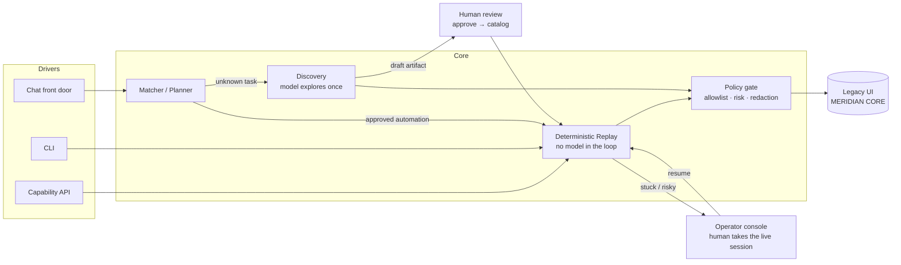

# Ledgerhand

A model drives a legacy UI once to figure out how a task is done. That run gets compiled into a
typed capability artifact, which is then replayed with no model in the loop: typed inputs and
outputs, declared business outcomes kept separate from failures, and a handoff to a human when
replay can't safely continue.

The target app is a local stand-in for a legacy bank console. It's built to be awkward on
purpose - framesets, table layout, no test ids - rather than to look like a real banking
service. A catalog and CLI expose saved capabilities so an agent could call them by name.

Design notes are in [REPORT.md](REPORT.md). Saved runs are in [evidence/](evidence/). The suite
is 162 automated tests across 24 files plus a strict typecheck (`npm test`, `npm run typecheck`).



Every driver converges on the same replay engine behind the same policy gate: the chatbot cannot
reach anything the API would refuse, and neither can skip a draft's human review.

## Setup

Requirements: Node 20.

```bash
nvm use 20
npm install
npx playwright install chromium
cp .env.example .env
```

The CLI is available through the npm scripts. For the copy-pasteable commands below, define the local command once from the repository root:

```bash
ledgerhand() { npx --no-install tsx src/cli/index.ts "$@"; }
```

| Variable | Required | Purpose |
| --- | --- | --- |
| `ANTHROPIC_API_KEY` | Only for `discover` | Credentials for the one-time model-driven discovery run. |
| `TARGET_APP_PORT` | No | Default target-app port, `4599`. |
| `OPERATOR_PORT` | No | Default operator-console port, `4610`. |
| `CONSOLE_PORT` | No | Default run-console port, `4620`. |
| `APP_USER` | No | Local stand-in operator ID, default `OPER01`. |
| `APP_PASSWORD` | No | Local stand-in password, default `demo-pass-01`. |
| `MERIDIAN_OPERATOR` / `MERIDIAN_PASSWORD` | For Meridian replays | Meridian Core teller sign-on, `teller1` / `password` (public demo credentials). |
| `MERIDIAN_HOLD_OPERATOR` / `MERIDIAN_HOLD_PASSWORD` | For the hold capability | Operator profile the hold capability signs on as; `super1` completes, `teller1` demonstrates the escalation. |
| `CHAT_MODEL` | No | Model behind the console's Chat tab, default `claude-sonnet-5`. |

Replay, catalog, invoke, the target app, the run console, and the operator console run without
`ANTHROPIC_API_KEY`. The console's Discover tab disables itself, with the reason shown, when the key
is absent.

## Watching a run: the console

The CLI runs one capability and prints the result after the fact. The console runs the same code
and streams what it is doing while it happens, which is the faster way to see why a run went wrong.

```bash
ledgerhand app --port 4599      # terminal 1
ledgerhand console --port 4620  # terminal 2
```

Open <http://127.0.0.1:4620>. The console presents one concept — **Automation** — over the
existing Discovery/Replay machinery. The workflow is: choose where Ledgerhand may work, tell it
what you want done, and it handles the rest safely.

**Target System** — a searchable, single-select list of configured systems (`config/targets.json`,
~15 presets across banking, insurance, healthcare, logistics, …), each showing how many approved
automations the catalog actually holds for it. One run is locked to one target's origin: the
allowlist below the model is derived from the selection, and pasting an entry URL auto-selects the
matching preset (an unknown URL becomes an in-memory Custom Target scoped to that origin alone).
A target appearing in the list never implies an automation exists for it — the counts say that.

**Automation Mode** — `Automatic` (default): search the approved catalog for the task; a strong
match runs deterministic Replay, no match starts Discovery, and an existing similar draft is
offered for review instead of silently rediscovering. `Replay Only`: approved automations only —
if none matches, the console says so and Discovery is a separate, optional button. `Discover
Only`: always explore and record a new draft.

**Chat** is the front door: questions that expect a choice — confirming an irreversible action,
picking a share — arrive with one-tap reply buttons, so a confirmation is a click on
"Yes, proceed" rather than something typed. Describe the task, and Ledgerhand reports whether it already knows it
("I found an existing automation: `meridian.member.balance`. Running it now.") or offers
Discovery. The chat's tool catalog is scoped to the selected target, and it uses the same
guardrailed invoke path as every other caller. **Manual Run** (compact button, top left) swaps
only the left panel for advanced controls — goal, typed inputs, credential profile, entry URL,
fault injection, step limits — while the live stage and steps stay visible; "← Back to Chat"
restores the default view.

The center stage shows the live browser frame (refreshed about once a second, held on the last
frame when a run ends), plain-language run statuses (`PREPARING`, `REPLAYING`, `APPROVAL
REQUIRED`, `HUMAN HELP REQUIRED`, `SUCCESS`, …), and an execution badge making the architecture
visible: `Deterministic Replay — AI not used` during replay, `AI exploring (Discovery)` during
discovery. The right column is the technical timeline: every event as it is emitted, expandable to
raw JSON, with **Verbose** revealing per-action mechanics. Events reach the page through the same
`RunLogger` the log file uses, after redaction, so the panel can never show a secret the log would
have masked.

Four questions stay separate in the UI, and in the state model underneath:

1. **Target** — where is Ledgerhand allowed to operate? (the selected system, one per run)
2. **Knowledge** — does an approved automation for the task exist? (`AUTOMATION FOUND` vs
   `NEW AUTOMATION REQUIRED`)
3. **Permission** — can the signed-in account complete it? A permission wall hit mid-Replay
   pauses the run with a `PERMISSION REQUIRED` card: Ledgerhand never switches to a
   higher-privilege account on its own; the card links to the Operator Console for human
   takeover of the same live browser session.
4. **Approval** — an irreversible step (where the artifact requires it) pauses the run *before*
   acting, with a prominent `APPROVAL REQUIRED` card — member, share, inputs, and
   `Approve and Continue` / `Cancel` — right in the main console.

Discovery ends in `DISCOVERY COMPLETE — Review Required`, never in a runnable automation: the
**Review Automation** overlay shows exactly what Replay would execute (steps, checkpoints,
credential env-var *names*), and only an explicit **Approve** promotes the draft. Drafts are
refused by every invocation surface — chat, the runs API, and the catalog API alike.

**Credential profiles** (per target, in the plan card) select which env-var *names* a run reads —
e.g. Meridian's "Teller (teller1)" vs "Supervisor (super1)" — so the supervisor-wall demo needs no
`.env` editing. The mapping is name→name, chosen explicitly before the run, recorded in evidence,
and never changed mid-run.

Everything below still works from the CLI, and the CLI remains the scriptable path with meaningful
exit codes.

## MERIDIAN CORE: the hosted adaptation target

`capabilities/meridian.*.v1.json` point the same core at MERIDIAN CORE, a hosted legacy
credit-union servicing console at `https://web-sample.interface-hiring.com` — server-rendered
HTML, table layout, a per-transaction hidden token, and injectable runtime faults. There is no
local app to start; the capabilities drive the live site. The write-up of what the adaptation
took is in [ADAPTATION.md](ADAPTATION.md).

Sign-on-based capabilities take an optional `branch` input (`MAIN-001`, `WEST-014`, `EAST-022`;
defaults to `MAIN-001`) and prove the chosen branch in the session's status bar. Discovery against
Meridian names its credential env vars per run — `--secret MERIDIAN_OPERATOR --secret
MERIDIAN_PASSWORD` on the CLI; in the console the selected target supplies its own credential
env-var names (`config/targets.json`), overridable under Manual Run → Advanced.

The function surface is covered by these artifacts:

| Capability | Does | Notable |
| --- | --- | --- |
| `meridian.signon` | Sign on, confirm the main menu | `INVALID_CREDENTIALS` outcome |
| `meridian.member.lookup` | Search members by last name | `NO_MATCH` outcome |
| `meridian.member.balance` | Read a member's record and primary share balance | `demo-maintenance` / `demo-timeout` / `demo-server-error` tenant variants |
| `meridian.member.shares` | List every share on a member's record | powers the chat's option lists |
| `meridian.share.balance` | Read one share's type, balance and status by exact share ID | row selected by `{{inputs.shareId}}` |
| `meridian.funds.transfer` | Fill, review and post a transfer | irreversible post step; `INSUFFICIENT_FUNDS` |
| `meridian.share.open` | Open a new share through review | returns the new share id |
| `meridian.member.update` | Save new contact details | `VALIDATION_REJECTED` carries the app's message |
| `meridian.account.hold` | Supervisor-gated hold through review and post | escalates as teller; pauses for approval at post |

### Meridian demo path

Start the console (`ledgerhand console --port 4620`) for the watchable version of everything
below, or run the commands as they are. Seed members: 100234, 100987, 101555, 102777, 103001.
For the shortest version, `bash scripts/demo.sh` runs a success, a business outcome, and a
recovered fault back to back.

1. Balance check (happy path):

   ```bash
   ledgerhand replay capabilities/meridian.member.balance.v1.json --input memberNumber=100987
   ```

   Expected: `SUCCESS` with `memberName`, `primaryShareId`, `primaryShareBalance`, `primaryShareStatus`; exit `0`.

2. Business outcome — no such member:

   ```bash
   ledgerhand replay capabilities/meridian.member.balance.v1.json --input memberNumber=999999
   ```

   Expected: `BUSINESS_OUTCOME MEMBER_NOT_FOUND`, exit `0`.

3. Funds transfer, posted for real against the live console:

   ```bash
   ledgerhand replay capabilities/meridian.funds.transfer.v1.json \
     --input memberNumber=100987 --input fromShareId=100987-S0001 \
     --input toShareId=100987-S0070 --input amount=1.00 --input memo="demo"
   ```

   Expected: `SUCCESS` with a `CN…` confirmation number. With `amount=999999.00` instead:
   `BUSINESS_OUTCOME INSUFFICIENT_FUNDS`, exit `0`.

4. Injected faults, deterministically, via the demo tenant variants:

   ```bash
   ledgerhand replay capabilities/meridian.member.balance.v1.json --tenant demo-maintenance --input memberNumber=100987
   ledgerhand replay capabilities/meridian.member.balance.v1.json --tenant demo-timeout --input memberNumber=100987
   ledgerhand replay capabilities/meridian.member.balance.v1.json --tenant demo-server-error --input memberNumber=100987
   ```

   Expected: the first two recover (dismiss the 503 interstitial; re-sign-on after the 440
   session kill) and end `SUCCESS`; the third ends `FAILED SURFACE_ERROR` with the observed
   `HTTP 500`, exit `1`.

5. The supervisor wall, both ways:

   ```bash
   # As the teller profile: stops at the 403 and escalates. Exit 2.
   MERIDIAN_HOLD_OPERATOR=teller1 MERIDIAN_HOLD_PASSWORD=password \
     ledgerhand replay capabilities/meridian.account.hold.v1.json \
     --input memberNumber=100987 --input shareId=100987-S0070 \
     --input reasonCode=FRAUD --input notes="demo"

   # As the supervisor, with the operator console for the irreversible approval:
   ledgerhand replay capabilities/meridian.account.hold.v1.json --operator \
     --input memberNumber=100987 --input shareId=100987-S0070 \
     --input reasonCode=FRAUD --input notes="demo"
   ```

   Expected: the supervisor run pauses at `Apply Hold` and prints an operator URL; approve
   there and it finishes `SUCCESS` with a confirmation number.

   In the console the same two paths need no env editing: plan *"Put a fraud hold on member
   100987"* on Meridian Core, pick the **Teller (teller1)** credential profile to hit the
   supervisor wall (`PERMISSION REQUIRED` → Operator Console), or **Supervisor (super1)** to
   reach the `APPROVAL REQUIRED` card and approve the post from the main console.

6. The capability API (the console must be running):

   ```bash
   curl -s http://127.0.0.1:4620/api/catalog | head -40
   curl -s -X POST http://127.0.0.1:4620/api/catalog/meridian.member.balance/invoke \
     -H 'content-type: application/json' \
     -d '{"inputs":{"memberNumber":"100234"}}'
   ```

   Expected: the invoke call answers with `{ runId, result }` where `result` is the same
   structured verdict the CLI prints — and the run is watchable on the console while it happens.

7. The chatbot: open the console's **Chat** tab and ask
   *"What is the balance for member 100234?"* or
   *"Transfer $5 from 100987-S0001 to 100987-S0070, memo demo"*. Each reply cites the run it
   invoked; clicking the chip shows that run's timeline, frame, and evidence.

8. From scratch — the discovery fallback. Delete (or move aside) everything in `capabilities/`
   and ask the chat for a balance anyway. The console reports that no automation exists and
   starts Discovery on the spot; the run records a draft, the draft is reviewed and approved,
   and the same request then replays deterministically — for any member, not just the one the
   recording saw. `evidence/runs/19-fresh-discovery-from-chat` and
   `evidence/runs/20-fresh-draft-replay-and-notfound` are one full pass of exactly that,
   including the cross-member replay and a `MEMBER_NOT_FOUND` business outcome.

Saved Meridian runs — one per demonstration above, including the discovery recording — are
committed under `evidence/runs/10-meridian-*` through `20-*` as the offline backup.

A note on the operator console's trust model: it binds to `127.0.0.1` and carries no
authentication — whoever can reach the loopback interface can approve an intervention. That is
an accepted cut for a single-operator demo; a deployment would put an authenticated,
audit-logged surface in front of it (the intervention records already capture who-did-what).

## Exact demo path (local stand-in app)

Run each numbered command from the repository root. Leave command 1 running in its terminal; the remaining commands can run in a second terminal after defining the `ledgerhand` function above.

1. Start the target app:

   ```bash
   ledgerhand app --port 4599
   ```

   Expected: `[ledgerhand] target app listening at http://127.0.0.1:4599`.

2. Discover once. This is the only step that needs `ANTHROPIC_API_KEY`:

   ```bash
   ledgerhand discover --goal "Look up a member savings balance" --url http://127.0.0.1:4599/t/alpha/msc/login --input memberId=10001
   ```

   Expected: the model works through the app and the recorder writes a new draft artifact under
   `capabilities/`. One such run is already committed as
   `capabilities/member-savings-balance.discovered.v1.json`, with its transcript in
   `evidence/runs/00-discovery-live-llm-run/`.

3. Replay the approved balance artifact:

   ```bash
   ledgerhand replay capabilities/member-savings-balance.v1.json --input memberId=10001
   ```

   Expected: `SUCCESS`, `savingsBalance` is `1250.75`, and the process exits `0`.

4. Inject a not-found business result:

   ```bash
   ledgerhand replay capabilities/member-savings-balance.v1.json --input memberId=10001 --inject not_found
   ```

   Expected: `BUSINESS_OUTCOME MEMBER_NOT_FOUND` and process exit `0`. This is a legitimate answer, not a failure.

5. Inject an application failure:

   ```bash
   ledgerhand replay capabilities/member-savings-balance.v1.json --input memberId=10001 --inject app_error
   ```

   Expected: `FAILED SURFACE_ERROR`, including the failing step, expected action, and observed `APPLICATION ERROR - REF 0x5A2`; process exit `1`.

6. Replay the same base artifact for beta:

   ```bash
   ledgerhand replay capabilities/member-savings-balance.v1.json --input memberId=10001 --tenant beta
   ```

   Expected: `SUCCESS` with the same `savingsBalance` as alpha. The beta entry URL and per-step label/button/column deltas are resolved at runtime; no second balance artifact is used.

7. Inspect the agent-facing catalog:

   ```bash
   ledgerhand catalog list
   ledgerhand catalog tools
   ```

   Expected: `list` prints capability metadata and `tools` prints Anthropic-style typed tool schemas. Draft capabilities are excluded from `tools` unless `--include-draft` is supplied.

8. Run the escalation demo for the sub-account capability:

   ```bash
   ledgerhand replay capabilities/subaccount-open.v1.json --input memberId=10001 --operator
   ```

   Expected: replay prints an operator-console URL and pauses at the irreversible Confirm step. Open that URL, click `Take control`, click the Confirm button in the live screenshot view, then click `Resume`. The same BrowserSession continues and the replay exits `0` after the creation checkpoint is observed. For a standalone console process, use `ledgerhand operator --port 4610`.

Replay exit codes are: `0` for success or a declared business outcome, `2` for escalation, and `1` for failure.

## Running without live services or a key

```bash
npm test
npm run typecheck
```

The suite starts the target app on its own ports and drives a real browser, but nothing leaves
the machine. Discovery is tested through a scripted model client, so the agent loop, the
recorder, replay, catalog, tenant merging, drift evidence and the operator handoff are all
covered with no API key.

`discover` is the only command that needs a key.

## What is mocked

The operator console's live view is a screenshot poll with coordinate input forwarding, not a
real co-browsing stack. What's underneath it is real: one shared BrowserSession, explicit
control transfer, policy-checked and recorded human actions, and checkpoint-based resume.

The target app is a stand-in, not a real system. Full cut list is in REPORT.md section 7.
